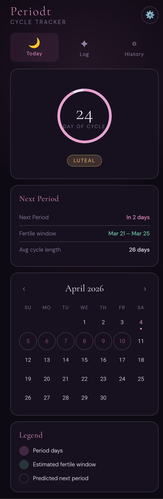
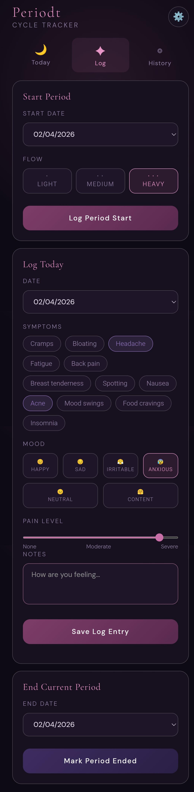
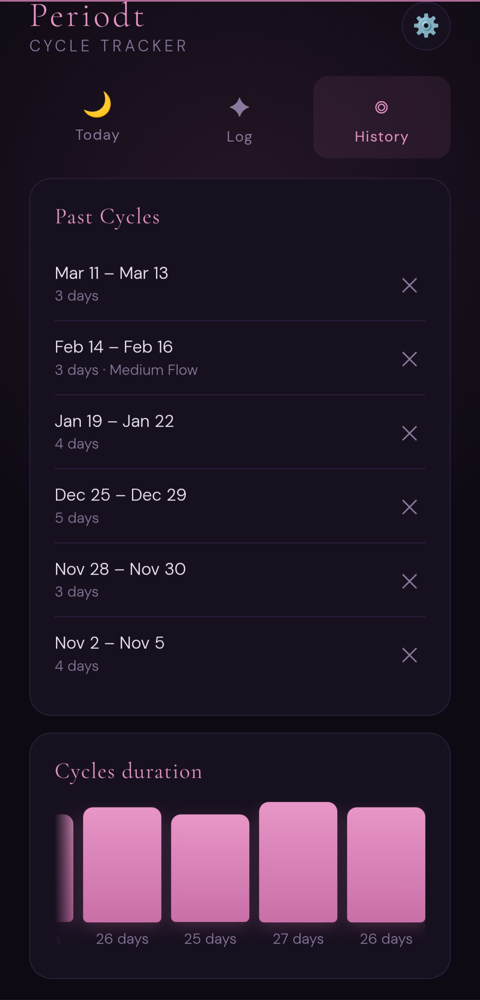
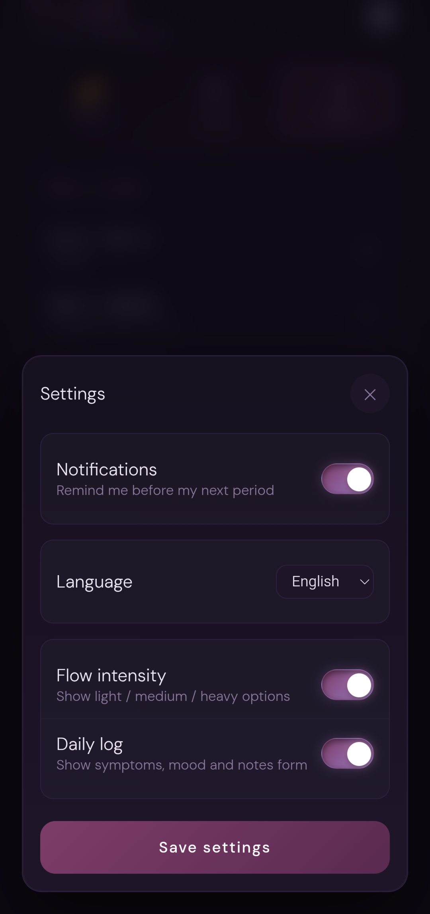

<h1> Periodt — Period Tracker</h1>

[](https://github.com/andreuinyu/periodt/actions/workflows/smoke-tests.yml)
[](https://github.com/andreuinyu/periodt/actions/workflows/lint.yml)
[](https://github.com/andreuinyu/periodt/actions/workflows/trivy-vulnscan.yml)
[](https://hub.docker.com/r/andreuinyu/periodt/)
[](https://hub.docker.com/r/andreuinyu/periodt/)


A privacy-first, self-hosted, dead simple period tracking Progressive Web App. Data stays in your server of choice and you can use it on the web or on your phone as an app.

<details>
<summary>View screenshots</summary>
<p>
  
  
  
  
</p>

</details>

### PWA Features

Periodt is built as a [Progressive Web App](https://en.wikipedia.org/wiki/Progressive_web_app), which is basically a website that can be "installed" on a device as a standalone application. This allows the users to have a nice mobile experience, without having to develop Android and iOS standalone applications and the hassle of publishing them on app stores.
- **Offline support** — service worker caches the app shell; API calls fall back gracefully when offline
- **Home screen install** — an install banner appears automatically in supported browsers (Chrome, Edge, Safari on iOS via "Add to Home Screen")
- **Push notifications** — Opt in in the Settings page; the backend stores subscriptions in SQLite 

⚠️IMPORTANT⚠️: this will only work if you access your Periodt service via [HTTPS](#https).

---

## 🐋 Setup with Docker Compose
Create a (or add to your existing) `docker-compose.yml` file in a folder of your choosing:
```yaml
services:
  periodt:
    container_name: periodt
    image: ghcr.io/andreuinyu/periodt:latest # or, andreuinyu/periodt:latest
    restart: unless-stopped
    ports:
      - "3111:8000"
    volumes:
      - ./periodt_data:/data
    environment:
      - TZ=UTC
      - NOTIFY_DAYS_BEFORE=3
      - NOTIFY_HOUR=9
```
and bring it up with
```bash
docker compose up -d
```
### Configuration

Edit `docker-compose.yml` to change the port:

```yaml
  ports:
    - "2333:8000"   # expose on port 2333
```
or modify the environment variables to the values that suit you the best (if not provided at all, the values will default to these values shown above):
```yaml
  environment:
    - TZ=Europe/Dublin
    - NOTIFY_DAYS_BEFORE=5
    - NOTIFY_HOUR=7
```
  * `TZ` should be something like America/New_York or Europe/Dublin. Find out which one suits you best [here](https://en.wikipedia.org/wiki/List_of_tz_database_time_zones#List).
  * `NOTIFY_DAYS_BEFORE` configures how many days before the period is supposed to arrive (based off of the historic average) should notifications be sent out to subscribed users.
  * `NOTIFY_HOUR` configures at what time will the server check if notifications are to be sent out.

### Data Persistence
If instead of useing a real path of your choosing `/path/to/your/periodt_data:/data` to map the database file out of Docker, you are using a docker volume in the [docker-compose.yml](docker-compose.yml) (like `periodt_data:/data`), you can still back it up with:

```bash
docker run --rm -v periodt_data:/data -v $(pwd):/backup alpine \
  cp /data/tracker.db /backup/tracker_backup.db
```

## Installing on mobile
* **Android (Chrome):** tap the install banner or browser menu → "Add to Home Screen"  
* **iOS (Safari):** Share → "Add to Home Screen"

⚠️IMPORTANT⚠️: this will only work if you access your Periodt service via [HTTPS](#https).

## HTTPS

There are many ways to route your self-hosted services through HTTPS. Amongst them:

* **Reverse proxy:** [Nginx](https://hub.docker.com/_/nginx/), [Caddy](https://github.com/caddyserver/caddy), [Traefik](https://github.com/traefik/traefik), ...
* **Tunnel (mostly free) services:** [Cloudflare Tunnel](https://developers.cloudflare.com/tunnel/), [ngrok](https://ngrok.com/), [Tailscale](https://tailscale.com/docs/how-to/set-up-https-certificates), ...
* **Self-Managed TLS certificates**

---

# Development
Any help is welcome, but especially:
* Translations: please, copy one of the existing .json in [frontend/static/translations](frontend/static/translations) and translate all its entries to a missing language. Then, also add the necessary option in [index.html](frontend/index.html) (where `value` is the name of each .json).
    ```html
    <select id="lang-select" class="settings-select">
      <option value="en">English</option>
      <option value="cat">Català</option>
      <option value="es">Español</option>
      ...
    </select>
    ``` 
* Design: Icons, styles, hell, even the name of this thing. 
* Annoyingly obvious features a simple period tracker should have that this one doesn't.

### Stack

| Layer | Tech |
|-------|------|
| Backend | Python 3.14 + FastAPI |
| Database | SQLite |
| Frontend | Vanilla JS PWA |
| Container | Docker + Docker Compose |

Set yourself up with:

```bash
# 1. Clone / download this folder
cd periodt

# 2. Build and start
docker compose up --build

# 3. Open your browser
open http://localhost:3111
```

### API Endpoints

| Method | Path | Description |
|--------|------|-------------|
| GET | `/api/cycles` | List all cycles |
| POST | `/api/cycles` | Start a new cycle |
| PATCH | `/api/cycles/{id}` | Update cycle (e.g. set end date) |
| DELETE | `/api/cycles/{id}` | Delete a cycle |
| GET | `/api/symptoms` | List symptom logs |
| POST | `/api/symptoms` | Log symptoms |
| DELETE | `/api/symptoms/{id}` | Delete a symptom log |
| GET | `/api/predictions` | Get next period prediction |
| GET | `/api/push/vapid-public-key` | Get key for push notifications |
| POST | `/api/push/subscribe` | Register push subscription |
| POST | `/api/push/unsubscribe` | Delete push subscription |
| GET | `/api/version` | dev for local or vX.Y.Z for release |

Interactive API docs: http://localhost:3111/docs

---

## Project Structure

```
period-tracker/
├── Dockerfile
├── docker-compose.yml # for local developing
├── README.md
├── backend/
│   ├── main.py          # FastAPI app
│   ├── notifications.py # Notification handling
│   └── requirements.txt
└── frontend/
    ├── index.html       # PWA shell
    ├── sw.js        # Service worker
    └── static/
        ├── manifest.json
        ├── scripts.js
        ├── styles.css
        ├── translations/LANGUAGE.json
        └── icons/
            ├── icon-192.png
            └── icon-512.png
```
